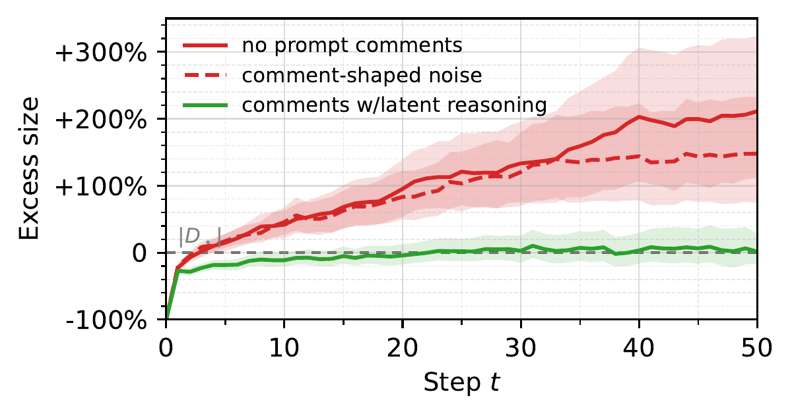

# prompt-comments

Stops `AGENTS.md` / `CLAUDE.md` from growing without bound.

Adding an instruction is cheap. Deleting it is a guess once nobody remembers
why it exists. This package makes the *agent* write the why at add time, even
when the user never mentioned the file.

Based on Chakrabarti, [*Why Does CLAUDE.md Keep Growing?*](https://arxiv.org/abs/2608.11095)
(arXiv:2608.11095).

## Why these files grow

Across 1,867 public repos and 247k instruction lifetimes, agent READMEs
(`AGENTS.md`, `CLAUDE.md`, `copilot-instructions.md`) more than triple
over their life (+226%). Median file ends at 39 instructions. Net +4.9
instructions per commit. Deletion gets *less* likely as a rule ages
(log-hazard −0.032/commit) and as more authors touch the file.

That is not staleness (old rules would die more) and not only fragile
content dying young. The instruction stays; the *why* decays. The paper
calls this **catastrophic remembering**. Adding is always cheap.
Deleting without the original rationale is a guess — a safe audit is
exponential in prompt size; writing the why at add time is O(1).

~77% of instruction deaths are wholesale rewrites. Size drops, then
growth resumes faster (4.1% → 4.9% per commit). A clean file with no
comments refills. Stronger models make this worse: they add more
insurance rules.

Comments that work name the failure, a hypothesis, and the **outcome**
(plus how often it recurred). Comment-shaped noise does nothing. A
story with no outcome is worse than no comment.



*From Chakrabarti, Fig. 1(a). Uncommented prompts ratchet; informative comments settle near the minimum cover. Lab covers were 2–3 instructions, not the real median of 39 — direction holds, the % is not a target.*

Do not auto-delete from a recovered why — their protocol emptied about
1 prompt in 8, and the uncommented arm scored higher on those worlds.
Keep a human in the deletion path.

## How a user uses this

They install it. Then they keep working. They do not invoke a slash command
and they do not ask the agent to update instructions.

Agents already add rules to `AGENTS.md` / `CLAUDE.md` as a side effect of
normal work. After install:

1. **Skill description** tells the agent to load this protocol whenever *it*
   edits those files, not only when the user names them.
2. **Write-time hook** (Claude Code / Codex plugin) intercepts `Write`/`Edit`
   of those files and blocks new instructions that lack `failed` / `outcome` /
   `recurred` comments. Existing uncommented files stay editable.
3. **Prime extension** does the same on `edit` / `ipython` / `bash`.
4. **`AGENTS.md` fallback** for hosts that only inject a context file
   (Gemini CLI and others).

## Install

### skills.sh (70+ agents)

```sh
npx skills add vladzima/prompt-comments -g --all
```

That installs the skill. For write-time blocking in Claude Code, also:

```sh
claude plugin marketplace add vladzima/prompt-comments
claude plugin install prompt-comments@prompt-comments
```

### Prime Agent

Prime already loads `~/.agents/skills/`, so the skills.sh install above is
the skill. The Prime package is **extension-only** (the write-time gate).
Do not expect it to ship a second `SKILL.md`; that collides with the
skills.sh copy.

```sh
npx skills add vladzima/prompt-comments -g --all
prime-agent package install https://github.com/vladzima/prompt-comments
```

### Manual

```sh
git clone https://github.com/vladzima/prompt-comments.git
```

Then copy `skills/prompt-comments` into your agent's skills dir.

## What the agent writes

```md
Use bun, not npm.
# failed: npm install rewrote the lockfile and broke CI (2026-03-12)
# try: bun matches CI
# outcome: lockfile stable after switch
# recurred: 2
```

No named failure → do not add the rule. No outcome → do not add the comment.
Deletes stay manual. Wholesale rewrites must port comments.

## License

MIT.
